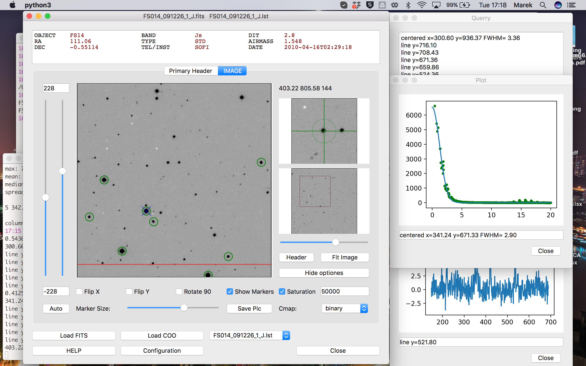

# FitsView
Python Fits Viewer - **FitsView 1.0**

**31.03.2022**  
**Marek Gorski** 

### Reguirements:
*python3, PyQt5, astropy, numpy, matplotlib, scipy*  

### Run:

```console
./FitsView.py plik.fits 
```
**or**  

```./FitsView.py plik.fits 400 500```  #  mark point  
```./FitsView.py plik.fits plik.out```  #  mark all point from plik.out  


### Basic functions and layout of the program.

Fits file is displayed as the **image**. On the right side, the upper window shows **vievfinder** window with **aperture** marked as the green circle. Below is the **thumbnail** of the main image. You can **zoom** with the slider below this window. You can navigate by left-clicking on the main image, or by left-clicking on the thumbnail.  
The **Show optiones** allows to adjast contrast level with sliders on the left. The slider limits can be manualy edited and changed. You can **flip** the image in X and Y axis and **rotate** the image by 90 deg. Those operations **do not change** the working coordinates of the image. You can dispaly instrumental coordinates in **FitsView**, and extensions *.coo*, *.ap*, *.lst*, *.als*, *.out*, *.tfr* and *.rsl* are recognized as the *daophot* specific files. Other options are *obvious*.



#### Keybord functions

When the main window is active and pointer is hovering over the image, pressing specific **key** will activate desired function. Result will be displayed in a **Querry Window**, or other specific window. Numeric result will be printed in short version to a **terminal**.

*   **m** : mark point on the image
*   **d** : delete marker on the image
*   **g** : goto - put x and y coordinates in a popup dialog window. Marker will be set on this coordinates and image will be centered on this point
*   **f** : find - if coordinate file was loaded, the line from this file with the closest coordinates is printed.
*   **b** : background - measure background in counts/pixel. Measuremetn is averaged from the viefinder aperture. Use before **q** and **z** functions
*   **z** : zero-point - set up a zero point for magnitude calculations. Press over the star with known magnitude, and put this magnitude in a popup dialog window.
*   **q** : querry - get total counts in the vievfinder aperture. If background measuremtn was performed before, background will be subtracted. If zero-point was set-up, magnitude will be calculated with respect to the zero-point.
*   **c** : column - ADU counts profile in a specific column is plotted. If used with zoomed image, only visible part of the column is plotted.
*   **l** : line - ADU counts profile in a specific line is plotted. If used with zoomed image, only visible part of the line is plotted.
*   **e** : elipse - izophots of part of the image are plotted.
*   **r** : radial profile of ADU counts is plotted. The centroid is calculated and Gauss function is fitted with the resulting FWHM.
*   **x** : xternal - magic option for external functions.

#### Configuration

Number of setting can be set up, and will be used with the next runn of the script. 
To save those setting, in the Config window edit specific value and press **Save CFG**. To update changed values on the current display press **Update CFG**. You can save *main window geometry*, *image display settings* and *zoom setting* by checking corresponding **checkbox**. 
Configuration is saved and reed from the config file (**FitsView.cfg**). By removing particular line from this file, the default value is adopted. Any of the configuration values can be passed to the program with the **Widget approach**, as the cfg list can be passed as the argument of the Widget.

#### Widget

You can run this script as the part of other python scripts as the Widget. 
Examples: 


`cp FitsView* .` # copy FitsView files to working directory 

```
from FitsView_gui import * # load FitsView class to Your script 
cfg=["x_Col=1","y_Col=2"] # set up desired configuration. 
FV_window = FitsView(cfg) # run the Pymage Widget class 
FV_window.fname="plik.fits" # define FITS file name 
FV_window.newFits() # execute new fits 
FV_window.show() 
```
To show points on fits:
```
FV_window.coo_file="plik.coo" # define file with object coordinates 
FV_window.load_coo() # execute new coo file 
FV_window.show() 
```
or
```
FV_window.ext_x=[10,10,300] 
FV_window.ext_y=[20,40,60] 
FV_window.ext_l=["raz","dwa","trzy"] 
FV_window.update() 
```
Special x function start 
```
FV_window.special=True 
FV_window.com.xPressed.connect(self.stopFunction) #emitts: "key", "x", "y" 
```
Special x function stop 
```
FV_window.special=False 
FV_window.com.xPressed.disconnect(self.stopFunction) 
```


#### Libraries:

Python3  
Astropy  
NumPy  
SciPy  
matplotlib  
PyQt5

#### Issues & ToDo:

*   On Mac OS Maveric in PyQt5 there is a bug with CSlider. If more than one (horizontal or vertical) are present, the display is messing first with the second.  

*   There can be some problems with PyQt 5.15\. Use later versions.
